<div align="center">
  <h1>
    
  </h1>

  <p align="center">
    
    
    
    
  </p>

  <p align="center">
    <a href="#tính-năng-chính">Tính năng</a> •
    <a href="#cài-đặt">Cài đặt</a> •
    <a href="#cấu-hình">Cấu hình</a> •
    <a href="#sử-dụng">Sử dụng</a> •
    <a href="#đóng-góp">Đóng góp</a>
  </p>
</div>

## 📝 Mô tả

<div align="center">
  
</div>

Bot Telegram giúp quản lý lịch dạy của giáo viên, cho phép xem lịch và báo nghỉ một cách dễ dàng. Dữ liệu được đồng bộ với Google Sheets.

## ⭐ Tính năng chính

<div align="center">
  
</div>

- 📅 Xem lịch dạy cá nhân
- 🔔 Báo nghỉ dạy
- 👥 Đăng ký giáo viên dạy thay
- 📊 Tích hợp với Google Sheets
- 🔄 Cập nhật realtime

## 🔧 Cài đặt

<div align="center">
  
</div>

```
git clone https://github.com/your-username/teacher-schedule-bot.git

cd teacher-schedule-bot

pip install -r requirements.txt
```

## ⚙️ Cấu hình

<div align="center">
  
</div>

1. Tạo bot Telegram qua [@BotFather](https://t.me/botfather)
2. Tạo project Google Cloud và bật Google Sheets API
3. Tạo service account và tải file credentials.json
4. Cập nhật `bot_key.py`:
```python
bot_key = "YOUR_BOT_TOKEN"
sheet_id = "YOUR_SHEET_ID"
```

## 🔄 Luồng Hoạt Động

```mermaid
flowchart TD
    A[Người dùng] --> B{Bot Telegram}
    B --> C[Xem lịch dạy]
    B --> D[Báo nghỉ]
    C --> E[Google Sheets API]
    D --> F[Nhập ngày nghỉ]
    F --> G[Chọn ca nghỉ]
    G --> H[Xác nhận]
    H --> I[Nhập GV dạy thay]
    I --> E
    E --> J[(Database)]
```

<div align="center">
  
</div>



## 📚 Cấu Trúc Dữ Liệu

<div align="center">
  
</div>

| Cột | Mô tả |
|-----|--------|
| A | Ngày |
| B | Ca dạy |
| C | Môn học |
| D | Lớp |
| E | Phòng |
| F | Giáo viên |
| G | Trạng thái |
| H | GV dạy thay |

## 🚀 Sử dụng

<div align="center">
  
</div>

1. Khởi động bot:
```bash
python main.py
```

2. Tương tác với bot qua Telegram:
- `/start` - Bắt đầu
- Chọn "Xem lịch dạy" hoặc "Báo nghỉ"
- Làm theo hướng dẫn của bot

## 🤝 Đóng góp

<div align="center">
  
</div>

1. Fork project
2. Tạo branch mới (`git checkout -b feature/AmazingFeature`)
3. Commit thay đổi (`git commit -m 'Add some AmazingFeature'`)
4. Push to branch (`git push origin feature/AmazingFeature`)
5. Tạo Pull Request

## 📝 License

<div align="center">
  
</div>

MIT License - Xem [LICENSE](LICENSE) để biết thêm chi tiết

---
<div align="center">
  Made with ❤️ by Shyn
  
</div>